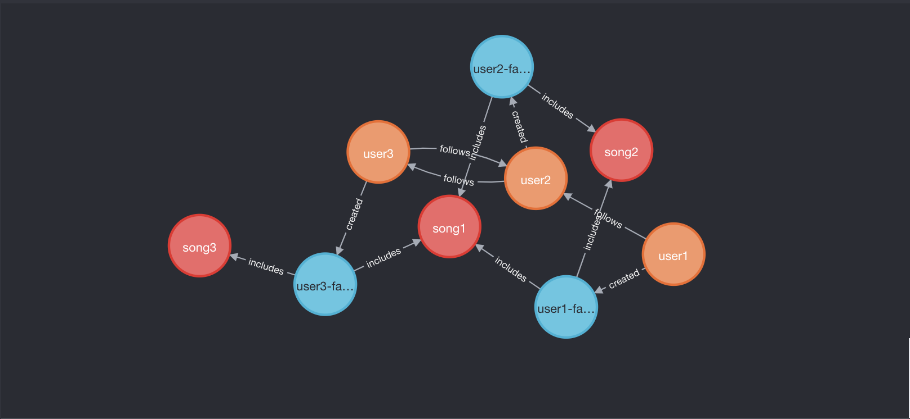
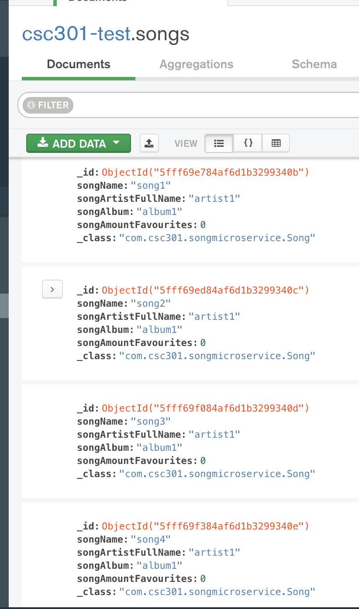

# Getting Started 
To get the project locally on your computer : 
* clone the repo: https://github.com/divyam-p/SpotifyAPIClone
* open with some IDE  
  * for Eclipse : 
    * go to File -> Import -> Maven -> Existing Maven Projects and open both the "profile-microservice" and the "song-microservice" as seperate projects 
    * Start both your neo4j server on "bolt://localhost:7687" (can use Neo4j Desktop version 3.5.20, make sure to have database name as "neo4j" and password as "1234") and MongoDB on "localhost:27017" (can use MongoDB compass) 
    * Run both the "ProfileMicroservice.java" and "SongMicroservice.java" file as a Java Application 
    * You are all set up! 

# Built With 
* Java 
* MongoDB 
* Neo4j
* Java Sprint Framework 
* Maven

# Description 
>> This is a Java REST API project using microservices (MongoDB and Neo4J) that communicate with each other to accomplish specific use-cases. 
* The MongoDB database is used to keep track of the Songs that different profiles (people) can like or dislike. 
* The Neo4J database is used to keep track of profiles which can like or dislike songs as well as follow or unfollow friends to figure out what songs their friends currently like. 
* NOTE : Specifications to the different API calls can be found in the code itself in the ProfileDriverImpl.java, PlaylistDriverImpl.java, and SongDalImpl.java. 

# Project Images 

    
  

    
  
# Acknowledgements 
Made By: 
* Divyam Patel 
* Samyak Mehta
